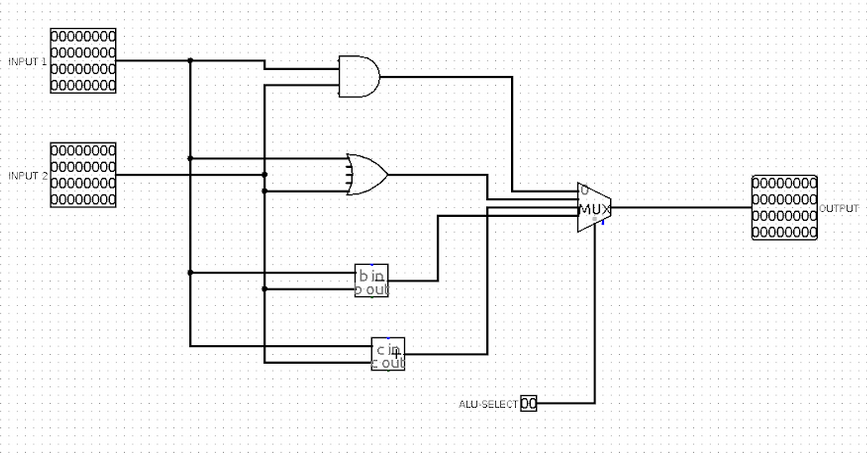
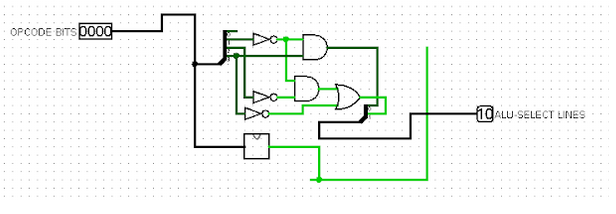
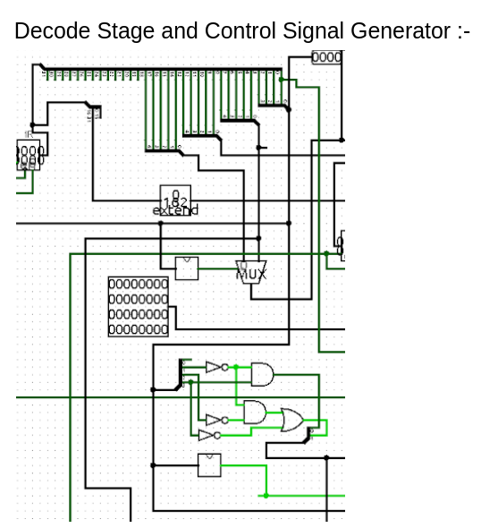
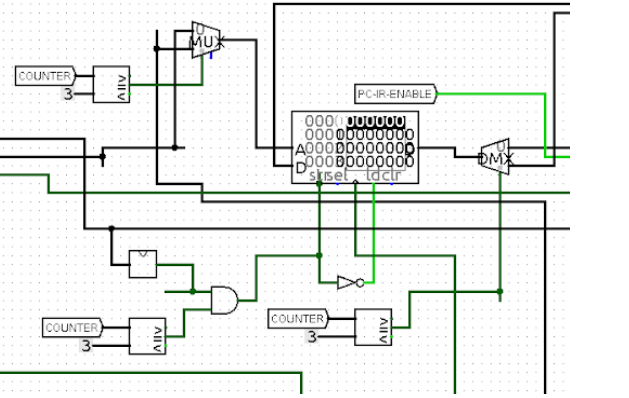

# Logisim-RISC-Processor
A 32 - BIT RISC Processor implemented on Logisim.

#### Instruction Encoding Scheme:-
1. For Instructions without Immediate Value:-
    
2. For Instructions without Immediate Value:-
   

#### The instruction Set of the processor consists of the following assembly commands:-

1. Move (MOV)
2. MOVE IMMEDIATE (MVI)
3. LOAD
4. STORE
5. ADD
6. ADD IMMEDIATE (ADI)
7. SUBTRACT (SUB)
8. SUBTRACT IMMEDIATE(SUI)
9. AND
10. AND IMMEDIATE (ANI)
11. OR 
12. OR IMMEDIATE (ORI)
13. HALT

#### Assembler Table​ :-

| Assembly Instruction     | OP-Code |
| ------------------------ | ------- |
| Move (MOV)               | 0000    |
| Move Immediate (MVI)     | 0001    |
| Load                     | 0011    |
| Store                    | 0101    |
| Add                      | 0110    |
| Add Immediate (ADI)      | 0111    |
| Subtract (SUB)           | 1000    |
| Subtract Immediate (SUI) | 1001    |
| AND                      | 1010    |
| And Immediate (ANI)      | 1011    |
| OR                       | 1100    |
| OR Immediate (ORI)       | 1101    |
| HALT                     | 1110    |

 

##### For more documentation and sample examples, have a look at -  [Encoding Schema and Examples ](Logisim-RISC-Processor/Encoding-Scheme-with-Examples.pdf) file.

##### Circuit Designs for some components:-

1. ALU 
   

2. Controll Signal generator for ALU
    

3. Decode Stage and Control Signal Generator
    

4. Memory
     